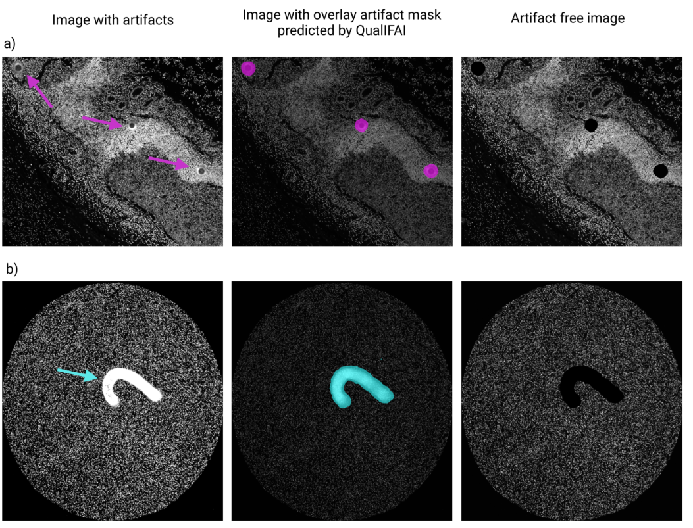
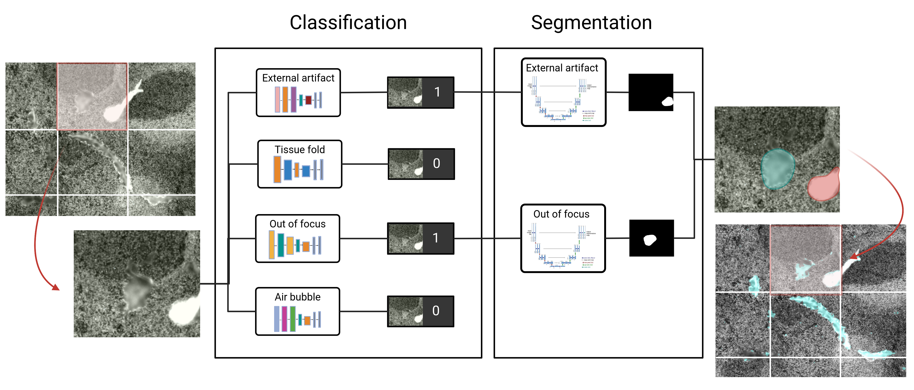
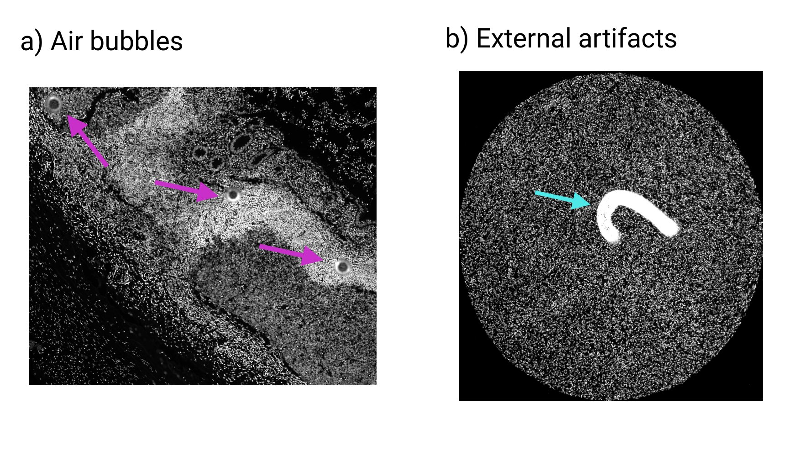

# QualIFAI

## Introduction
Qual-IF-AI is an automated tool for the identification and management of undesired artifacts in immunofluorescence images. Qual-IF-AI can detect five of the most common types of artifacts including: Air bubbles, External artifacts, Tissue folds, Out of focus areas, and antibody aggregates.

## Purpose
Fluorescent imaging has become an indispensable tool in various biological disciplines, enabling the study of protein dynamics, cellular functions, and neuronal activity, among others (Šachl and Amaro, 2023). With the recent development of multiplex immunofluorescent imaging, the simultaneous detection and quantification of multiple markers in a single tissue section has become feasible (Bosisio et al., 2022). The analysis of the images generated with multiplex immunofluorescent imaging requires an extensive pipeline of preprocessing steps, including illumination correction, image registration (in the case of cyclic multiplexing methods), cell segmentation and autofluorescence subtraction before extracting quantitative single-cell measurements from the images (Antoranz et al., 2022; Eng et al., 2022; Schapiro et al., 2022). The quality of the input images is crucial to obtain reliable single-cell measurements and meaningful biological insights. Undesired artifacts, such as external artifacts (dust particles, hair shafts, fibers), air bubbles, antibody aggregates, out-of-focus (OOF) areas, and tissue folds are common not only in hematoxylin and eosin (H&E) images (Taqi et al., 2018) but also in fluorescent microscopy (Jiang et al., 2023). Dust particles, hair shafts, fibers, and air bubbles can get trapped during sample preparation or coverslipping. Denatured antibodies can lead to antibody aggregation artifacts in the images. Misalignment of coverslip or inaccurate calculation of focus depth or tissue detachment during scanning can give rise to OOF areas. Suboptimal tissue embedding or tissue sectioning can lead to tissue folding or even complete tissue detachment from the slide (Taqi et al., 2018). These artifacts can significantly impact quantitative image analysis by including false positives and false negatives (Dimitriou et al., 2019; Wright et al., 2021). Traditionally, artifacts are manually annotated and removed from the images. With the rise of multiplexing, the number of images generated per experiment is drastically increasing, making manual annotation extremely laborious and time-consuming. Moreover, manual annotation is subjective and contingent on high intra- and inter-user variability (Brunt et al., 2022; van der Laak et al., 2021). To overcome these challenges, automated tools for detecting and managing artifacts in an unbiased and reproducible way are a necessity. Although some automated tools for detecting artifacts in histopathology images exist (Hosseini et al., 2020; Janowczyk et al., 2019; Kanwal et al., 2024; Ke et al., 2023; Rodrigues et al., 2023), limited tools are available for fluorescent microscopy.
Here, we present QUAL-IF-AI, an automated, accessible, and reliable tool for artifact detection and management in fluorescent microscopy, facilitating precise analysis of multiplexed immunofluorescence images. We demonstrate the utility of QUAL-IF-AI in detecting four of the most common types of artifacts in fluorescent imaging: air bubbles, tissue folds, external artifacts, and out-of-focus areas. We show how QUAL-IF-AI outperforms state-of-the-art methodologies in a variety of multiplexing platforms achieving over 85% of classification accuracy and more than 0.6 Intersection over Union (IoU) across all artifact types.

## Workflow
Qual-IF-AI consists of two modules 1. Classification : Identification of image patches having artifacts. 2.Segmentation: Delineation of the area covered by the artifacts.

### Usage
In this section the usage of QUAL-IF-AI is described. In brief, input images are tesselated into patches of fixed size (512x512). Second, the tiles are classified between "clean" and "having artifacts". Third, the patches identified as "having artifacts" are segmented. Finally, the results are ensembled generating the final artifact mask. This mask is eventually applied to the input image to subtract the affected area for downstream analyses. This process will be ilustrated using an in-house-generated Diffuse large B cell lymphoma and kidney tissue images acquired with the MILAN [ref] multiplexing technology. The input image looks as follows:

## Citation
[Bioarxiv](https://www.biorxiv.org/content/10.1101/2024.01.26.577391v1.abstract)

## Requirements:

| Library               | Version   |
|-----------------------|-----------|
| keras                 | 2.11.0    |
| Keras-Applications    | 1.0.7     |
| Keras-Preprocessing   | 1.1.2     |
| matplotlib            | 3.5.3     |
| matplotlib-inline     | 0.1.6     |
| numpy                 | 1.21.5    |
| pandas                | 1.3.5     |
| pickleshare           | 0.7.5     |
| Pillow                | 9.4.0     |
| pip                   | 22.3.1    |
| scikit-image          | 0.19.3    |
| scikit-learn          | 1.0.2     |
| scipy                 | 1.7.3     |
| seaborn               | 0.12.2    |
| segmentation-models   | 1.0.1     |
| tensorflow            | 2.4.1     |
| tensorflow-estimator  | 2.6.0     |
| tifffile              | 2021.11.2 |
| python                | 3.7.16    |
| glob2                 | 0.7       |

